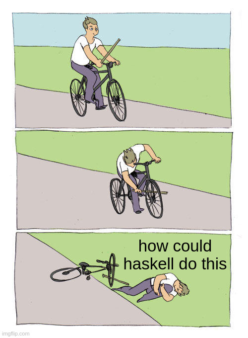
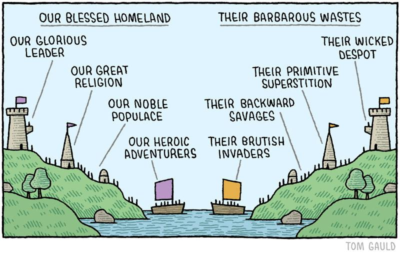
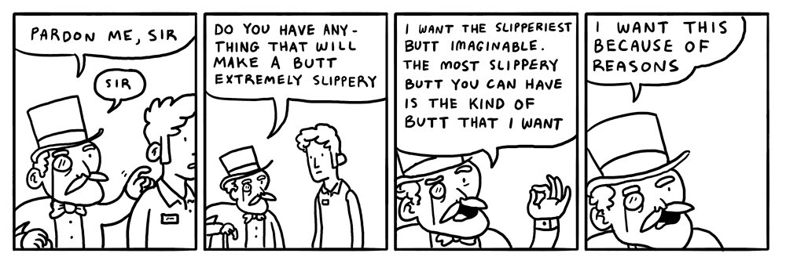
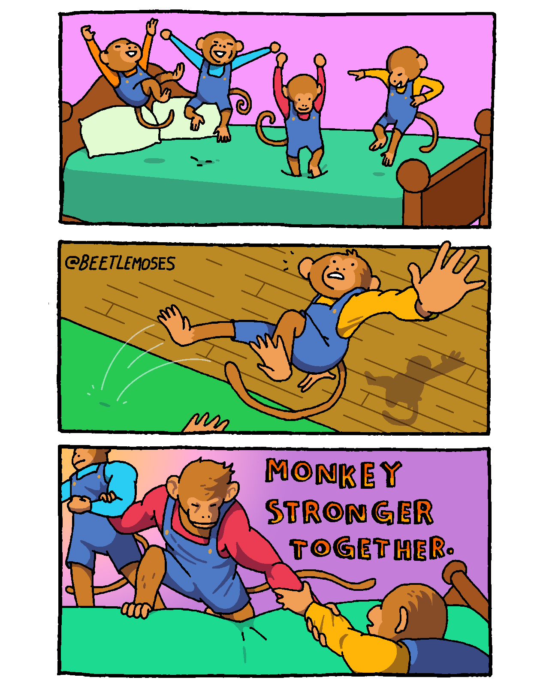

% How to stop writing Haskell
% (and how to start again)
% Vaibhav Sagar (vaibhavsagar.com)

# Why would you want to stop writing Haskell?

## Great question!

- Haskell is pretty great!
- Companies seem to stop writing Haskell surprisingly often!
- Why does this happen?

## An anecdote

## About this talk

- Names don't matter
- About Haskell-the-ecosystem rather than Haskell-the-language
- "All happy families are alike; each unhappy family is unhappy in its own way"
- In dialogue with Evan Czaplicki's talk on Saturday
- My perspective on the absurdity of the tech industry during an especially
  absurd time

## Suffering from success

# Some facts about Haskell

## Haskell is not mainstream

- Few domains where Haskell is the "safe" choice
- [Nobody Ever Got Fired for Picking Java](https://speakerdeck.com/al3x/nobody-ever-got-fired-for-picking-java)
- If your Haskell project fails, it's Haskell's fault

## Haskell is not mainstream

## Haskell is not trendy (anymore)

- Other, newer, languages: Rust, Lean, TypeScript, etc.
- Neither trendy enough nor niche enough

## Haskell avoids "success at all costs"

- Very sensitive to any one entity exercising undue influence
- Hard to imagine an equivalent to e.g. Jane Street for OCaml
- Competing tools/philosophies, e.g. `lens` vs. `optics`

# Some facts about companies

## Companies seek to maximise profit

- Specifically shareholder value
- Often incompatible with highest quality product, personal development, and
  other desirable outcomes
- [Worse Is Better](https://dreamsongs.com/WorseIsBetter.html)

## Most companies seek to maximise short-term profit

- Sometimes at the expense of long-term profit
- "The market can remain irrational longer than you can remain solvent" -
  Keynes
- Objectively bad decisions, e.g. doing a round of layoffs just before an
  earnings announcement to artificially boost the stock price

## Companies undervalue maintenance

- Constant pressure to "do more with less"
- [Nobody Ever Gets Credit for Fixing Problems that Never
  Happened](https://web.mit.edu/nelsonr/www/Repenning=Sterman_CMR_su01_.pdf)
- Firefighting is more visible and more likely to be rewarded

## Companies undervalue maintenance

# Why start using Haskell?

## Getting paid to write Haskell
1. Want to write Haskell
2. Convince someone with money to give you/your team that money
3. ????
4. PROFIT!!!

## Some reasons you might use
- Believing that Haskell is a good fit for your problem
- Trying to hire skilled programmers
- Trying to retain a key employee
- Getting people to work on something boring

# Taxonomy

## A non-exhaustive list
- The Second System
- The Experiment
- The Vanity Project
- The Giant Client
- The Acquisition
- The Insolvency
- The Ousting
- The Magpie
- The Rocket Explosion
- The Outgrowing

# Let's begin!

# The Second System

## The situation

- Company decides to rewrite a non-Haskell codebase in Haskell
- Implied (or explicit) outcome is that the existing team will lose their jobs

## The problem

- Adversarial relationship with current team
- Existing codebase provides business value so you have to work on it
- [Second-system effect](https://en.wikipedia.org/wiki/Second-system_effect)

## Second-system effect

## Hofstadter's Law

_It always takes longer than you expect, even when you take into account
Hofstadter's law._

## Suggestions

- Ask yourself why a rewrite is happening
- Many successful Haskell adoptions look like sidecars (microservices?)
- Threatening someone's livelihood is not a good way to get them on your side
- They probably don't want to learn a new language
- Explore your options! (This will come up a lot)

# The Second System Pt. II

## The situation

- Company decides to rewrite a Haskell codebase in a non-Haskell language
- Implied (or explicit) outcome is that the existing Haskell team will lose
  their jobs
- Some might leave after the decision anyway

## The situation

## The problem

- All the problems I mentioned before
- Working Haskell product is on life support
- Maintaining it is not a fun job (because maintenance is undervalued!)

## Suggestions

- Don't panic!
- Hofstadter's Law

# The Experiment

## The situation

- Funding (often fixed-term) to solve a problem with Haskell
- Eventually runs out

## The problem

- Software projects and tight deadlines don't mix
- Haskell is blamed for the failure
- The problem with venture capital is that you eventually run out of other
  people's money

## Suggestions

- Ride the gravy train till the end?
- Figure out an exit plan while things are still good

# The Vanity Project

## The situation

## The situation

- Somebody starts a Haskell project as a way of enriching their personal brand

## The problem

- Questionable attachment to Haskell or the project itself
- Increasingly bizarre requests for features

## Suggestions

- Ride the gravy train until the end?
- Use the opportunity for personal/professional development
- Try not to leave a smoking crater behind

# The Giant Client

## The situation

- Company ostensibly has multiple clients, in practice only one
- Client ends its contract

## The problem

- Niche client pool
- Buyer's market

## Suggestions

- Try very hard to avoid this situation
- Exit plan!

# The Acquisition

## The situation

## The situation

- Company is acquired by another, larger, company
- Often an acqui-hire rather than a product acquisition

## The problem

- Acquiring company has no attachment to Haskell
- One less Haskell company

## Suggestions

- Stay just long enough for your stock to vest?
- Exit plan!

# The Insolvency

## The situation

- Company runs out of money

## The problem

- Company runs out of money

## Suggestions

- You tell me?

# The Ousting

## The situation

- Influential person leaves the company or moves to a different role
- Their political capital was enabling the use of Haskell

## The problem

- Replacement wants to "shake things up" which usually involves getting rid of
  Haskell
- see: Second System Pt. II

## Suggestions

- This rarely happens immediately
- Could try to push back, but it might not work
- Exit plan!

# The Magpie

## The situation

## The situation

- Company picked Haskell because it was trendy at the time but has pivoted to
  e.g. Rust

## The problem

- Second System Pt. II
- No attachment to Haskell but also no attachment to the replacement language

## Suggestions

- Ask the difficult questions about why technology choices are made
- [Lindy effect](https://en.wikipedia.org/wiki/Lindy_effect)

# The Rocket Explosion

## The rocket explosion

## The situation

- Haskell codebase is too complicated

## The problem

- Abstraction ceiling in Haskell is enormously high
- Second System effect means the replacement could be worse!

## Suggestions

- Collectively agree and enforce which subset of Haskell you are using

# The Outgrowing

## The situation

- Company grows large enough that they have extremely specific requirements of
  the Haskell ecosystem

## The problem

- Companies are reluctant to fund this development work or do it themselves
- "Avoid success at all costs" means the ecosystem isn't going to do what you
  want just because you want it
- Eventually the codebase bitrots and a heroic effort to rewrite in another
  language starts

## Suggestions

- Put your money where your mouth is (nobody ever gets credit for fixing
  problems that never happened)
- Most large non-Haskell companies have teams dedicated to developer tooling
  for other languages, why not us?

# Recap

## A non-exhaustive list (again)
- The Second System
- The Experiment
- The Vanity Project
- The Giant Client
- The Acquisition
- The Insolvency
- The Ousting
- The Magpie
- The Rocket Explosion
- The Outgrowing

## Rarely Haskell-specific!

# What to do?

## Take care of yourself first

- Your greatest leverage as an individual is your ability to walk away
- Your reputation outlives any job you will have

## Just walk out

## Spend your political capital wisely

- If the approval for Haskell flows from you, things will probably change when
  you leave
- Pointing out mistakes to management might not work

## Collective action is pretty great

## Collective action is pretty great

## Failure is not the end

- Could do everything right and it might not matter
- That API DSL is very much alive and in use
- Make the most of the opportunities you have
- Hope springs eternal

# Is it worth it?

## Moving to New York City

## Starting my SPJ selfie collection

## Making new friends

## Moving back to Australia

## Scuba diving with my mum

## SPJ selfie 2

## Pursuing my passions

## One more SPJ selfie

# There's so much more Haskell to be written

# Thank you!

## Slides

https://vaibhavsagar.com/presentations/how-to-stop-writing-haskell/

# Questions
