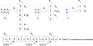
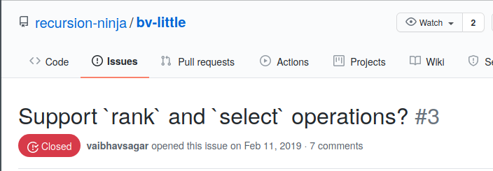

% Minimal Perfect Hashing
% Vaibhav Sagar (@vbhvsgr)

# Minimal Perfect Hashing

## FOSSASIA 2018

<iframe width="560" height="315" src="https://www.youtube.com/embed/8Zu-EVjN24s" frameborder="0" allow="accelerometer; autoplay; clipboard-write; encrypted-media; gyroscope; picture-in-picture" allowfullscreen></iframe>

## Minimal Perfect Hashing?

- Minimal
- Perfect
- Hashing

## Hashing

- function that takes a key to a fixed size value (often an integer)

## Perfect Hashing

- hashing without collisions (injective)

## Minimal Perfect Hashing

- perfect hashing without gaps
- bijective mapping from $n$ keys to $1..n$
- downsides: static, produces nonsense results for absent keys

# Approaches

## Not Discussed Today

- Hash, Displace, and Compress (CHD)
- Hypergraph peeling?

## Discussed Today

- Fast and scalable minimal perfect hashing for massive key sets
- [https://arxiv.org/abs/1702.03154](https://arxiv.org/abs/1702.03154)

# How does it work?


## Cascading Collisionless Bitarrays



## Requirements

- Family of hash functions
- Bitvectors supporting rank (and select)

## Family of hash functions?

- My understanding is that hash functions that take a salt should work

## Bitvectors supporting rank and select?

- Rank(i) is the number of $1$s at or prior to index $i$ (1-indexed)
- Select(i) is the index $n$ where the $i$th 1 is located (1-indexed)
- Fun phrase to google: "succinct data structures"

## Bitvectors supporting rank and select?



# How it works

## High level

1. Repeat the following until we've reached max level or there are no more keys
    1. Turn the key into a number $0..n-1$ where $n$ is the length of the bitvector
    1. Set the $i$th bit of the bitvector if unset, otherwise unset it and never set it again this iteration
    1. Remove the keys whose corresponding bits were set
1. If there are leftovers, put them in a hashtable

## Turning the key into a number

```haskell
-- gamma is a multiplier for the size of the bitvector
value = hashWithSalt currentLevel key `mod` (gamma * currentLength)
```

## Populating the bitvector

1. Initialise two bitvectors $B$ and $C$ with $0$s
1. When setting an index:
    1. If the value in $C$ is $0$, set it in $B$ to $1$
    1. If the value in $B$ is $1$ and $C$ is $0$, set the value at $B$ to $0$ and $C$ to $1$
    1. If the value in $B$ is $0$ and $C$ is $1$, do nothing

## Lookup

1. For each level:
    1. Hash the key and check if the corresponding index is set
    1. If so, find the rank
    1. If not, increment the level count
1. Otherwise check the leftovers

# Example

## Keys

- Bras Basah
- Bugis
- Outram
- Paya Lebar
- River Valley
- Tanjong Pagar

## Level 0

```
 0 1 2 3 4 5
┌─┬─┬─┬─┬─┬─┐
│0│0│0│0│0│0│ B
└─┴─┴─┴─┴─┴─┘
┌─┬─┬─┬─┬─┬─┐
│0│0│0│0│0│0│ C
└─┴─┴─┴─┴─┴─┘
```

## Level 0

```
 0 1 2 3 4 5
┌─┬─┬─┬─┬─┬─┐
│0│0│0│1│0│0│ B
└─┴─┴─┴─┴─┴─┘
┌─┬─┬─┬─┬─┬─┐
│0│0│0│0│0│0│ C
└─┴─┴─┴─┴─┴─┘
```

```haskell
> hashWithSalt 0 "Bras Basah" `mod` 6
3
```

## Level 0

```
 0 1 2 3 4 5
┌─┬─┬─┬─┬─┬─┐
│0│0│0│0│0│0│ B
└─┴─┴─┴─┴─┴─┘
┌─┬─┬─┬─┬─┬─┐
│0│0│0│1│0│0│ C
└─┴─┴─┴─┴─┴─┘
```

```haskell
> hashWithSalt 0 "Bugis" `mod` 6
3
```

## Level 0

```
 0 1 2 3 4 5
┌─┬─┬─┬─┬─┬─┐
│0│0│1│0│0│0│ B
└─┴─┴─┴─┴─┴─┘
┌─┬─┬─┬─┬─┬─┐
│0│0│0│1│0│0│ C
└─┴─┴─┴─┴─┴─┘
```

```haskell
> hashWithSalt 0 "Outram" `mod` 6
2
```

## Level 0

```
 0 1 2 3 4 5
┌─┬─┬─┬─┬─┬─┐
│0│0│1│0│0│0│ B
└─┴─┴─┴─┴─┴─┘
┌─┬─┬─┬─┬─┬─┐
│0│0│0│1│0│0│ C
└─┴─┴─┴─┴─┴─┘
```

```haskell
> hashWithSalt 0 "Paya Lebar" `mod` 6
3
```

## Level 0

```
 0 1 2 3 4 5
┌─┬─┬─┬─┬─┬─┐
│0│1│1│0│0│0│ B
└─┴─┴─┴─┴─┴─┘
┌─┬─┬─┬─┬─┬─┐
│0│0│0│1│0│0│ C
└─┴─┴─┴─┴─┴─┘
```

```haskell
> hashWithSalt 0 "River Valley" `mod` 6
1
```

## Level 0

```
 0 1 2 3 4 5
┌─┬─┬─┬─┬─┬─┐
│0│1│1│0│0│1│ B
└─┴─┴─┴─┴─┴─┘
┌─┬─┬─┬─┬─┬─┐
│0│0│0│1│0│0│ C
└─┴─┴─┴─┴─┴─┘
```

```haskell
> hashWithSalt 0 "Tanjong Pagar" `mod` 6
5
```

## Level 1

```
 0 1 2
┌─┬─┬─┐
│1│0│0│ B
└─┴─┴─┘
┌─┬─┬─┐
│0│0│0│ C
└─┴─┴─┘
```

```haskell
> hashWithSalt 0 "Bras Basah" `mod` 3
0
```

## Level 1

```
 0 1 2
┌─┬─┬─┐
│1│0│1│ B
└─┴─┴─┘
┌─┬─┬─┐
│0│0│0│ C
└─┴─┴─┘
```

```haskell
> hashWithSalt 0 "Bugis" `mod` 3
2
```

## Level 1

```
 0 1 2
┌─┬─┬─┐
│0│0│1│ B
└─┴─┴─┘
┌─┬─┬─┐
│1│0│0│ C
└─┴─┴─┘
```

```haskell
> hashWithSalt 0 "Paya Lebar" `mod` 3
0
```

## Level 2

```
 0 1
┌─┬─┐
│1│0│ B
└─┴─┘
┌─┬─┐
│0│0│ C
└─┴─┘
```

```haskell
> hashWithSalt 0 "Bras Basah" `mod` 2
0
```

## Level 2

```
 0 1
┌─┬─┐
│0│0│ B
└─┴─┘
┌─┬─┐
│1│0│ C
└─┴─┘
```

```haskell
> hashWithSalt 0 "Paya Lebar" `mod` 2
0
```

## ...

- I went ahead and ran this for 20 more levels and the keys kept colliding
- Let's try with `gamma = 2`

## Level 0

```
                     1 1
 0 1 2 3 4 5 6 7 8 9 0 1
┌─┬─┬─┬─┬─┬─┬─┬─┬─┬─┬─┬─┐
│0│0│0│0│0│0│0│0│0│1│0│0│ B
└─┴─┴─┴─┴─┴─┴─┴─┴─┴─┴─┴─┘
┌─┬─┬─┬─┬─┬─┬─┬─┬─┬─┬─┬─┐
│0│0│0│0│0│0│0│0│0│0│0│0│ C
└─┴─┴─┴─┴─┴─┴─┴─┴─┴─┴─┴─┘
```

```haskell
> hashWithSalt 0 "Bras Basah" `mod` 12
9
```

## Level 0

```
                     1 1
 0 1 2 3 4 5 6 7 8 9 0 1
┌─┬─┬─┬─┬─┬─┬─┬─┬─┬─┬─┬─┐
│0│0│0│1│0│0│0│0│0│1│0│0│ B
└─┴─┴─┴─┴─┴─┴─┴─┴─┴─┴─┴─┘
┌─┬─┬─┬─┬─┬─┬─┬─┬─┬─┬─┬─┐
│0│0│0│0│0│0│0│0│0│0│0│0│ C
└─┴─┴─┴─┴─┴─┴─┴─┴─┴─┴─┴─┘
```

```haskell
> hashWithSalt 0 "Bugis" `mod` 12
3
```

## Level 0

```
                     1 1
 0 1 2 3 4 5 6 7 8 9 0 1
┌─┬─┬─┬─┬─┬─┬─┬─┬─┬─┬─┬─┐
│0│0│1│1│0│0│0│0│0│1│0│0│ B
└─┴─┴─┴─┴─┴─┴─┴─┴─┴─┴─┴─┘
┌─┬─┬─┬─┬─┬─┬─┬─┬─┬─┬─┬─┐
│0│0│0│0│0│0│0│0│0│0│0│0│ C
└─┴─┴─┴─┴─┴─┴─┴─┴─┴─┴─┴─┘
```

```haskell
> hashWithSalt 0 "Outram" `mod` 12
2
```

## Level 0

```
                     1 1
 0 1 2 3 4 5 6 7 8 9 0 1
┌─┬─┬─┬─┬─┬─┬─┬─┬─┬─┬─┬─┐
│0│0│1│0│0│0│0│0│0│1│0│0│ B
└─┴─┴─┴─┴─┴─┴─┴─┴─┴─┴─┴─┘
┌─┬─┬─┬─┬─┬─┬─┬─┬─┬─┬─┬─┐
│0│0│0│1│0│0│0│0│0│0│0│0│ C
└─┴─┴─┴─┴─┴─┴─┴─┴─┴─┴─┴─┘
```

```haskell
> hashWithSalt 0 "Paya Lebar" `mod` 12
3
```

## Level 0

```
                     1 1
 0 1 2 3 4 5 6 7 8 9 0 1
┌─┬─┬─┬─┬─┬─┬─┬─┬─┬─┬─┬─┐
│0│1│1│0│0│0│0│0│0│1│0│0│ B
└─┴─┴─┴─┴─┴─┴─┴─┴─┴─┴─┴─┘
┌─┬─┬─┬─┬─┬─┬─┬─┬─┬─┬─┬─┐
│0│0│0│1│0│0│0│0│0│0│0│0│ C
└─┴─┴─┴─┴─┴─┴─┴─┴─┴─┴─┴─┘
```

```haskell
> hashWithSalt 0 "River Valley" `mod` 12
1
```

## Level 0

```
                     1 1
 0 1 2 3 4 5 6 7 8 9 0 1
┌─┬─┬─┬─┬─┬─┬─┬─┬─┬─┬─┬─┐
│0│1│1│0│0│1│0│0│0│1│0│0│ B
└─┴─┴─┴─┴─┴─┴─┴─┴─┴─┴─┴─┘
┌─┬─┬─┬─┬─┬─┬─┬─┬─┬─┬─┬─┐
│0│0│0│1│0│0│0│0│0│0│0│0│ C
└─┴─┴─┴─┴─┴─┴─┴─┴─┴─┴─┴─┘
```

```haskell
> hashWithSalt 0 "Tanjong Pagar" `mod` 12
5
```

## Level 1

```
 0 1 2 3 
┌─┬─┬─┬─┐
│0│0│1│0│ B
└─┴─┴─┴─┘
┌─┬─┬─┬─┐
│0│0│0│0│ C
└─┴─┴─┴─┘
```

```haskell
> hashWithSalt 1 "Bugis" `mod` 4
2
```

## Level 1

```
 0 1 2 3 
┌─┬─┬─┬─┐
│1│0│1│0│ B
└─┴─┴─┴─┘
┌─┬─┬─┬─┐
│0│0│0│0│ C
└─┴─┴─┴─┘
```

```haskell
> hashWithSalt 1 "Paya Lebar" `mod` 4
0
```

## Lookup

```default
                     1 1
 0 1 2 3 4 5 6 7 8 9 0 1
┌─┬─┬─┬─┬─┬─┬─┬─┬─┬─┬─┬─┐
│0│1│1│0│0│1│0│0│0│1│0│0│ b0
└─┴─┴─┴─┴─┴─┴─┴─┴─┴─┴─┴─┘
┌─┬─┬─┬─┐
│1│0│1│0│ b1
└─┴─┴─┴─┘
```

```haskell
> hashWithSalt 0 "Paya Lebar" `mod` 12
3
> hashWithSalt 1 "Paya Lebar" `mod` 4
0
> popCount b0 + rank b1 0
5
```

# Here's some code
