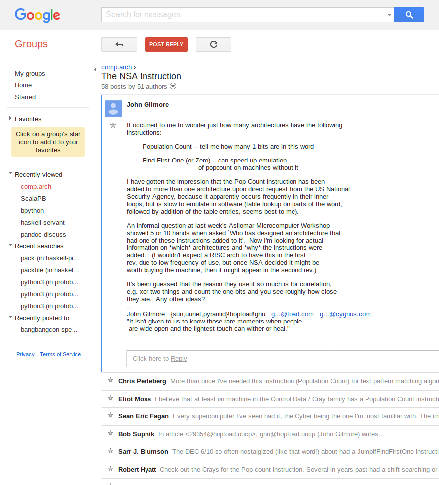

% You Won't Believe This One Weird CPU Instruction!
% Vaibhav Sagar (@vbhvsgr)

# `popcount`?

## Population Count

Counts the number of bits set to `1` in a machine word.

## `popcount`

`popcount(00100110) == 3`
`popcount(01100000) == 2`

## That's it, that's all it does.

## That doesn't seem very useful??

## CPUs with `popcount`

- IBM STRETCH
- CDC 6000
- Cray
- SPARC
- Intel Core (since 2008)
- ARM NEON
- RISC-V B extension

## What's going on?

# Cryptography

## The NSA Instruction

[source](https://groups.google.com/forum/#!msg/comp.arch/UXEi7G6WHuU/Z2z7fC7Xhr8J)

## The NSA Instruction

> It was almost a tradition that one of the first of any new
> faster CDC machine was delivered to a "good customer" - picked
> up at the factory by an anonymous truck, and never heard
> from again.

[source](http://cryptome.org/jya/sadd.htm)

## Hamming weight

The number of symbols that are different from the zero-symbol of the alphabet.

## Cryptanalysis

1. Set a bit for each character in each line of the input
2. You have 60-bit words, enough to handle most alphabets
3. `popcount` => count distinct characters
4. Use the count as a hash, or to do further analysis
5. ???
6. Profit!

[source](http://www.talkchess.com/forum3/viewtopic.php?t=38521)

## `popcount` disappears from CPUs: a conspiracy???

# Error correction

## Hamming distance

The number of differing positions between two strings of identical length.

## Hamming distance

For binary strings: `popcount(x ^ y)`

## Signal distance

Send some data over the wire and compare it at both ends to get an estimate of
the error rate.

## Error Correcting Codes

Based on your error correction requirements, choose sufficiently distant
symbols to assemble your message out of!

# Binary convolutional neural networks

## Binary

Uses +1 and -1 (coded as 0) instead of 32-bit floating point numbers.

## Convolutional

Matrix multiplication?

## Neural Network

¯\\_(ツ)_/¯

## Why?

Simpler and smaller, suitable for less powerful devices like mobile phones

## Matrix multiplication

1. x = xnor(a, b)
2. p = popcount(x)
3. n = len(a)
4. 2\*p - n

# Other fun uses of `popcount`

## Chess Engines

## Molecular Fingerprinting

## Hash Array Mapped Tries

## Succinct Data Structures

## Testing compiler optimisations

# Thanks!
