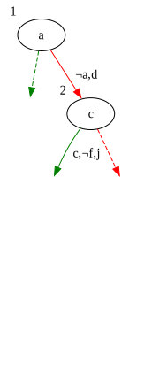
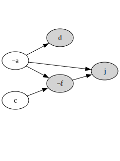

% SATisfying Solutions to Difficult Problems!!
% Vaibhav Sagar (@vbhvsgr)

# SAT Solvers??

## NP-complete problems

- Decision (yes/no) problems
- Can be verified quickly (in polynomial time)
- Currently unknown how to solve quickly (P versus NP problem)
- All equivalent!

## Examples

- Knapsack
- Travelling salesman
- Subset sum
- Graph coloring
- Sudoku
- Boolean satisfiability

## Boolean Satisfiability Problem

Can we assign truth values to Boolean variables in propositional logic formulas
to satisfy the formula?

## Boolean Satisfiability Problem
- Commonly expressed like $(x \vee y \vee z) \wedge (x \vee \neg y) \wedge (\neg y \vee \neg x) \wedge (\neg z)$ (Conjunctive Normal Form)
- NP-complete (!)
- Can express any other NP-complete problem!

## SAT Solvers

Programs that solve boolean satisfiability problems and tell you satisfying
assignments!!

# Sudoku

## Example

_Tim Stellmach, CC0, via Wikimedia Commons_

## Rules

- one digit per cell
- each digit once per row/column
- each digit once per 3x3 sub-grid
- must use filled-in cells

## Insight

- 9 boolean variables for each cell!
- only 1 is true, other 8 are false
- $x_{r,c,1}$, $x_{r,c,2}$,...,$x_{r,c,9}$

## Each cell has at least one value

$$(x_{1,1,1} \vee x_{1,1,2} \vee \dots \vee x_{1,1,9}) \wedge$$
$$(x_{1,2,1} \vee x_{1,2,2} \vee \dots \vee x_{1,2,9}) \wedge$$
$$ \dots $$
$$(x_{9,9,1} \vee x_{9,9,2} \vee \dots \vee x_{9,9,9})$$

## Each row has all values

$$(x_{1,1,1} \vee x_{1,2,1} \vee \dots \vee x_{1,9,1}) \wedge$$
$$(x_{1,1,2} \vee x_{1,2,2} \vee \dots \vee x_{1,9,9}) \wedge$$
$$ \dots $$
$$(x_{9,1,9} \vee x_{9,2,9} \vee \dots \vee x_{9,9,9})$$

## Each cell has at most one value

$$(\neg x_{1,1,1} \vee \neg x_{1,1,2}) \wedge$$
$$(\neg x_{1,1,1} \vee \neg x_{1,1,3}) \wedge$$
$$ \dots $$
$$(\neg x_{9,9,8} \vee \neg x_{9,9,9})$$

## Solving

1. Express your problem as a propositional logic formula in CNF
2. Feed it to a SAT solver
3. ????
4. PROFIT!!!

# DPLL

## Example

$$(x \vee y \vee z) \wedge (x \vee \neg y) \wedge (\neg y \vee \neg x) \wedge (\neg z)$$

$x$: 🤷 
$y$: 🤷 
$z$: 🤷 

## Pick a variable

Let's set $z$ to False

## Unit propagation

- If there is a unary clause, assign it
- Delete all clauses that are satisfied
- Remove the literal where it is False

## Example

$$(x \vee y \xcancel{\vee {\color{red} z}}) \wedge (x \vee \neg y) \wedge (\neg y \vee \neg x) \xcancel{\wedge {\color{green} (\neg z)}}$$

$x$: 🤷 
$y$: 🤷 
$z$: `False` 

## Pick a variable

Let's set $y$ to True

## Example

$$\xcancel{{\color{green}(x \vee y \vee z)} \wedge} (x \xcancel{\vee {\color{red} \neg y}}) \wedge (\xcancel{{\color{red} \neg y} \vee} \neg x) \xcancel{\wedge {\color{green }(\neg z)}}$$

$x$: 🤷 
$y$: `True` 
$z$: `False` 

## Conflict!

## Backtrack

Let's set $y$ to False

## Example

$$(x \xcancel{\vee {\color{red} y} \vee {\color{red} z}) \wedge {\color{green}(x \vee \neg y)} \wedge {\color{green} (\neg y \vee \neg x)} \wedge {\color{green} (\neg z)}}$$

$x$: 🤷 
$y$: `False` 
$z$: `False` 

## Pure literal elimination

There is only one possible value for $x$, so assign it

## Solution

$x$: `True` 
$y$: `False` 
$z$: `False` 

## Davis-Putnam-Logemann-Loveland

- Backtracking search
- Unit propagation
- Pure literal elimination

## Downsides

- Often finds the same conflict multiple times
- Backtracks one level at a time (chronologically)
- No memory of past conflicts

## Can we learn from our mistakes?

# CDCL

## CDCL

- Distinguishes between decisions (assignments) and implications (unit
  propagation, literal elimination)
- Keeps track of the implication graph

## Example

$$\begin{align}
& (a \vee d) \wedge \\
& (a \vee \neg c \vee \neg f) \wedge \\
& (a \vee f \vee j) \wedge \\
& (b \vee i) \wedge \\
& (\neg e \vee \neg c \vee g) \wedge \\
& (\neg e \vee f \vee \neg g) \wedge \\
& (e \vee f \vee \neg h) \wedge \\
& (e \vee h \vee \neg j)
\end{align}$$

## $a$

$$\begin{align}
& {\color{red} a} \vee {\color{green} d} \\
& {\color{red} a} \vee \neg c \vee \neg f \\
& {\color{red} a} \vee f \vee j \\
& b \vee i \\
& \neg e \vee \neg c \vee g \\
& \neg e \vee f \vee \neg g \\
& e \vee f \vee \neg h \\
& e \vee h \vee \neg j
\end{align}$$

## $c$

$$\begin{align}
& {\color{red} a} \vee {\color{green} d} \\
& {\color{red} a} \vee {\color{red}\neg c} \vee {\color{green} \neg f} \\
& {\color{red} a} \vee {\color{red} f} \vee {\color{green} j} \\
& b \vee i \\
& \neg e \vee {\color{red}\neg c} \vee g \\
& \neg e \vee {\color{red} f} \vee \neg g \\
& e \vee {\color{red} f} \vee \neg h \\
& e \vee h \vee {\color{red}\neg j}
\end{align}$$

## $b$

$$\begin{align}
& {\color{red} a} \vee {\color{green} d} \\
& {\color{red} a} \vee {\color{red}\neg c} \vee {\color{green} \neg f} \\
& {\color{red} a} \vee {\color{red} f} \vee {\color{green} j} \\
& {\color{red} b} \vee {\color{green} i} \\
& \neg e \vee {\color{red}\neg c} \vee g \\
& \neg e \vee {\color{red} f} \vee \neg g \\
& e \vee {\color{red} f} \vee \neg h \\
& e \vee h \vee {\color{red}\neg j}
\end{align}$$

## $e$

$$\begin{align}
& {\color{red} a} \vee {\color{green} d} \\
& {\color{red} a} \vee {\color{red}\neg c} \vee {\color{green} \neg f} \\
& {\color{red} a} \vee {\color{red} f} \vee {\color{green} j} \\
& {\color{red} b} \vee {\color{green} i} \\
& {\color{red}\neg e} \vee {\color{red}\neg c} \vee {\color{blue} g} \\
& {\color{red}\neg e} \vee {\color{red} f} \vee {\color{blue}\neg g} \\
& {\color{green} e} \vee {\color{red} f} \vee \neg h \\
& {\color{green} e} \vee h \vee {\color{red}\neg j}
\end{align}$$

## Unique Implication Point

$$\displaylines{\neg (\neg f \wedge c \wedge e) \\
\iff \\
(f \vee \neg c \vee \neg e)}$$

## Learned Clause

$$f \vee \neg c \vee \neg e$$

## Learned Clause

$$\begin{align}
& (a \vee d) \wedge \\
& (a \vee \neg c \vee \neg f) \wedge \\
& (a \vee f \vee j) \wedge \\
& (b \vee i) \wedge \\
& (\neg e \vee \neg c \vee g) \wedge \\
& (\neg e \vee f \vee \neg g) \wedge \\
& (e \vee f \vee \neg h) \wedge \\
& (e \vee h \vee \neg j) \wedge \\\
& {\color{green}(f \vee \neg c \vee \neg e)}
\end{align}$$

## Backjumping

## Conflict-driven Clause Learning

- Learned clauses!
- Non-chronological backtracking!
- Basis of most modern SAT solvers

## Okay Now Let's Do A Silly One

# SLS

## What if we just guessed?

1. Generate a random assignment
2. Pick a random clause
3. Probabilistically flip a variable in the clause
4. Repeat until you solve it or get tired!

## Stochastic Local Search

- Surprisingly effective!
- WalkSAT
- Can be done in parallel
- Can use a form of clause learning
- Can't conclusively determine unsatisfiability(!)
- Reminds me of simulated annealing in some ways

# SMT

## Problem

$$
\begin{align}
  SEND &\\
+ MORE &\\
\hline
MONEY
\end{align}
$$

## How?

We'd have to teach the SAT solver arithmetic!

## Satisfiability Modulo Theories

- SAT solvers extended
- bitvectors, arrays, algebraic datatypes, etc.
- Z3, CVC, Yices, Boolector

# Recap

## SAT solvers

Solve NP-complete problems expressed as CNF Boolean formulas

## DPLL

- Backtracking search
- Unit propagation
- Pure literal elimination

## CDCL

- DPLL++
- Learned clauses
- Non-chronological backtracking

## SLS

- Random guessing
- Probabilistic variable flipping

## SMT solvers

SAT extended with theories

# That's all!

## Resources

- [Lindsey Kuper - Reasoning Under Uncertainty in SMT Solving, Research, and
  Life](https://www.youtube.com/watch?v=6K6HFl7UhQk)
- [The Science of Brute
  Force](https://cacm.acm.org/research/the-science-of-brute-force/)
- [Handbook of
  Satisfiability](https://www.iospress.com/catalog/books/handbook-of-satisfiability-2)
- [GRASP - A New Search Algorithm for Satisfiability (1996)](https://www.cs.cmu.edu/~emc/15-820A/reading/grasp_iccad96.pdf)
- [An Extensible SAT-solver (2003)](http://minisat.se/downloads/MiniSat.pdf)
- [CS-E3220: Propositional satisfiability and SAT
  solvers](https://users.aalto.fi/~tjunttil/2020-DP-AUT/notes-sat/overview.html)

## Slides

[https://vaibhavsagar.com/presentations/sat-solvers](https://vaibhavsagar.com/presentations/sat-solvers)

# Thank you!!
