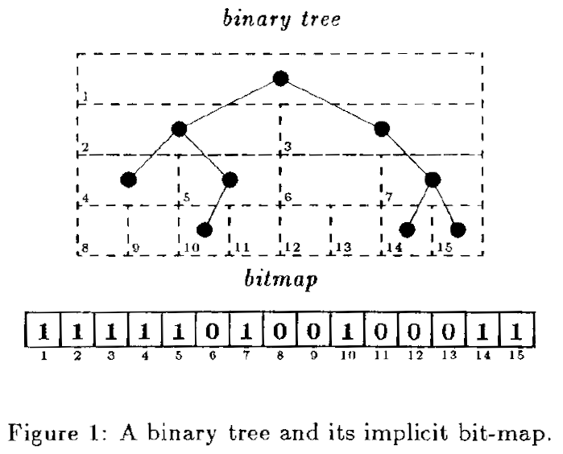

% Space-efficient Static Trees and Graphs
% Guy Jacobson
% (presented by Vaibhav Sagar)

# Data structures take up too much space!

## A pointer to $n$ possible locations needs $\log_2 {} n$ bits

## Data structures with $n$ items need $O(n\log_2 {} n)$ space for pointers!

## The rent is too damn high!

## Unlabeled binary trees only need $2n + o(n)$ bits

## One approach: balanced parentheses?

## Better space usage, but inefficient to use

## How do we get efficient space usage *and* efficient operations?

## Metrics for space and time

- Space: measured in bits
- Time: measured in bit-accesses

# Ranking and selection

## Rank

$rank_e(S, i)$: The number of $e$s at or before index $i$

## Select

$select_e(S, i)$: The index of the $i$th $e$

## Time complexity

- $O(\log_2 {} n)$ at the time of writing, $O(1)$ now!

## More resources

- [Succinct indexable dictionaries with applications to encoding k-ary trees and multisets](https://dl.acm.org/citation.cfm?id=545411)
- [Fast, Small, Simple Rank/Select on Bitmaps](https://users.dcc.uchile.cl/~gnavarro/ps/sea12.1.pdf)
- [Space-Efficient, High-Performance Rank & Select Structures on Uncompressed Bit Sequences](http://www.cs.cmu.edu/~dga/papers/zhou-sea2013.pdf)

## Rank/Select beyond bitmaps

- [Wavelet Trees for All](https://users.dcc.uchile.cl/~gnavarro/ps/cpm12.pdf)

# Trees

## Implicit bitmap

## Level-order binary marked

## Level-order binary marked

- $left\mbox{-}child(m) = 2 \cdot rank(m)$
- $right\mbox{-}child(m) = 2 \cdot rank(m) + 1$
- $parent(m) = select(\lfloor m/2 \rfloor)$

## Level-order unary degree sequence

## Level-order unary degree sequence

- $first\mbox{-}child = select_0(rank(m)) + 1$
- $next\mbox{-}sibling = m + 1$
- $parent(m) = select(rank_0(m))$

# Graphs

## Parentheses balancing

## Bounded pagenumber graphs
